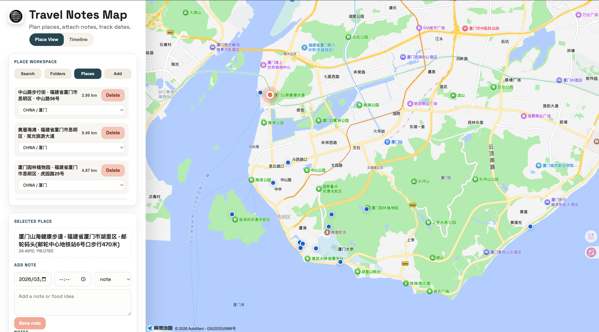
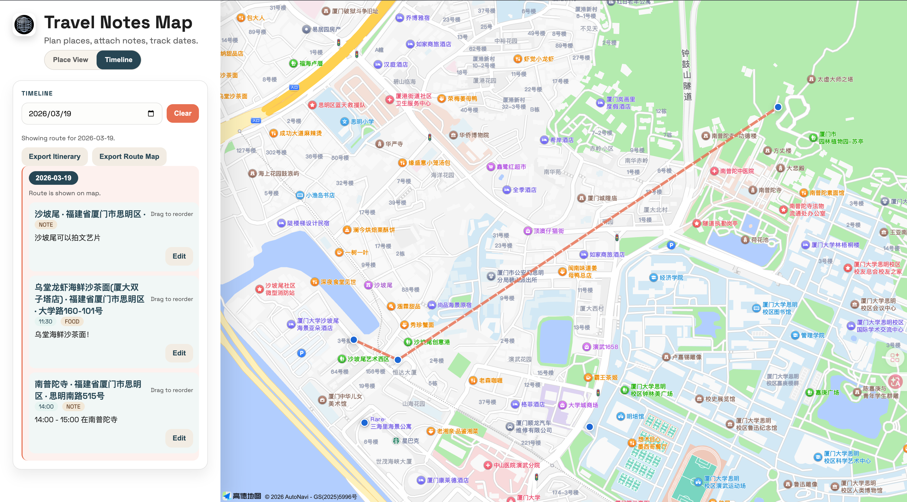
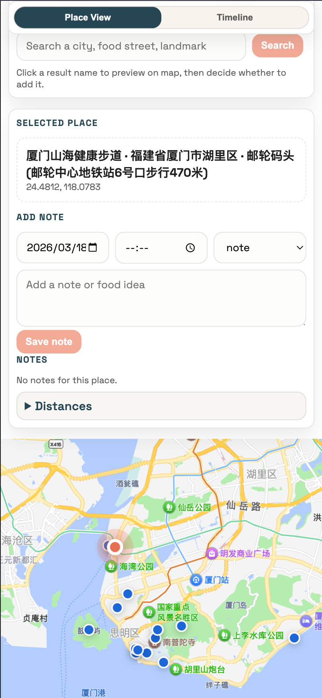

# Travel Notes Map

Travel planning app with map-based places, folder organization, dated notes, and timeline routing.

## Features
- Place workspace
  - Add places from search results or by picking a point on the map
  - Select/delete places
  - Move places into folders
- Folder workspace
  - Nested folders (`parentId`)
  - Create/rename/delete folders
  - Drag folders to change hierarchy (with cycle checks)
  - Deleting a folder removes all descendants and moves related places to `Unfiled`
- Notes
  - Add/edit/delete notes with `date`, optional `time`, and `type` (`note` or `food`)
  - Per-day ordering (`order`) for timeline rendering
- Timeline mode
  - Group notes by day
  - Drag and drop to reorder notes in the same day
  - Select a day to render route on map
  - Export day itinerary as PNG (`Export Itinerary`)
  - Export route overview image as PNG (`Export Route Map`)
- Distance helper
  - Shows distance from selected place to other visible places
- Provider-based map/search
  - `osm`: Leaflet + OpenStreetMap tiles + Nominatim search
  - `amap`: AMap JS API + AutoComplete search + district boundary highlight

## Screenshots
These screenshots help reviewers quickly understand the core workflow.

| Place + Map View | Timeline Route View | Mobile View |
| --- | --- | --- |
|  |  |  |


## Tech Stack
- Frontend: React + Vite
- Map:
  - Leaflet + React Leaflet (`osm`)
  - AMap JS API (`amap`)
- Backend: Node.js + Express
- Data: LowDB JSON file at `server/data/db.json`

## Project Structure
- `client/` React app
- `server/` Express API + LowDB persistence
- `server/data/db.json` runtime data file

## Run Locally
1. Start backend:
```bash
cd server
npm install
npm run dev
```

2. Start frontend (new terminal):
```bash
cd client
npm install
npm run dev
```

3. Open the Vite URL (usually `http://localhost:5173`).

Defaults:
- Frontend API base: `http://localhost:3001`
- Backend port: `3001`
- Map provider: `osm`

## Environment Variables

### Client (`client/.env`)
```bash
VITE_API_BASE=http://localhost:3001
VITE_MAP_PROVIDER=amap
# Get key/security from https://console.amap.com/dev/index
VITE_AMAP_KEY=
VITE_AMAP_SECURITY=
VITE_NOMINATIM_ENDPOINT=https://nominatim.openstreetmap.org/search
```

- `VITE_API_BASE`: backend base URL (default `http://localhost:3001`)
- `VITE_MAP_PROVIDER`: `osm` or `amap` (default `osm`)
- `VITE_AMAP_KEY`: required when `VITE_MAP_PROVIDER=amap`
- `VITE_AMAP_SECURITY`: optional AMap JS API security code
- `VITE_NOMINATIM_ENDPOINT`: optional custom endpoint for `osm` search

### Server
- `PORT`: backend port (default `3001`)

## API Overview

### Health
- `GET /api/health`

### Places
- `GET /api/places`
- `POST /api/places`
  - Body: `{ name, lat, lng, folderId? }`
- `PATCH /api/places/:id`
  - Body: `{ folderId }` (`null` or empty string to unfile)
- `DELETE /api/places/:id`
  - Also deletes notes linked to the place

### Folders
- `GET /api/folders`
- `POST /api/folders`
  - Body: `{ name, parentId? }`
- `PATCH /api/folders/:id`
  - Body: `{ name?, parentId? }`
- `DELETE /api/folders/:id`
  - Deletes folder + descendants, and clears `folderId` on affected places

### Notes
- `GET /api/notes`
  - Optional query params: `placeId`, `date`
- `POST /api/notes`
  - Body: `{ placeId, date, type?, content, time?, order? }`
- `PATCH /api/notes/:id`
  - Body: any of `{ date, type, content, time, order }`
- `DELETE /api/notes/:id`

## Data File
- File: `server/data/db.json`
- Root keys: `places`, `notes`, `folders`
- On server startup:
  - Missing root keys are normalized
  - Malformed JSON falls back to safe empty defaults

---
Last updated: 2026-03-17
